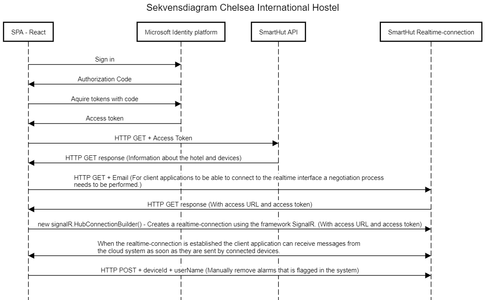

# Chelsea-international-hostel

## Instruktioner

**Förbered dator**

1. Installera node och npm från den här sidan https://nodejs.org/en/download/.
2. Verifiera installationen av node genom att skriva `node -v` i terminalen. Systemet bör visa vilken version du har installerad.
3. Verifiera installationen av npm genom att skriva `npm -v` i terminalen. Systemet bör visa vilken version du har installerad.
4. Installera npm globalet genom att skriva `npm install -g npm` i terminalen.

**Förbered och starta applikationen**

1. Ladda ner repot från https://github.com/jajo21/chelsea-international-hostel.
2. Leta upp valfri terminal och utgå från nerladdad chelsea-international-hostel mapp och skriv:`npm ci `, nu laddas alla nödvändiga paket för att starta applikationen ner.
3. När alla paket har laddats klart skriver du i terminalen: `npm start`, det här transpilerar koden via parcel och startar applikationen.
4. Normalt ska applikationen öppnas i din webbläsare, om den inte gör det, öppna valfri webbläsare och navigera in på https://localhost:5001.

---

## System arkitektur

### Sekvensdiagram - övergripande bild av hur kommunikationen i applikationen ser ut

_(Tryck på bilden för att göra den större)_

## Externa bibliotek

Man kan tydligt se vilka externa bibliotek som är installerade i package.json. Men här kommer en mindre övergripande förklaring.

### [Parcel](https://www.npmjs.com/package/parcel)

Parcel version 2.4.1: Används för att sätta upp en utvecklingsmiljö med transpilering och bundling.

### [@azure/msal-browser](https://www.npmjs.com/package/@azure/msal-browser)
